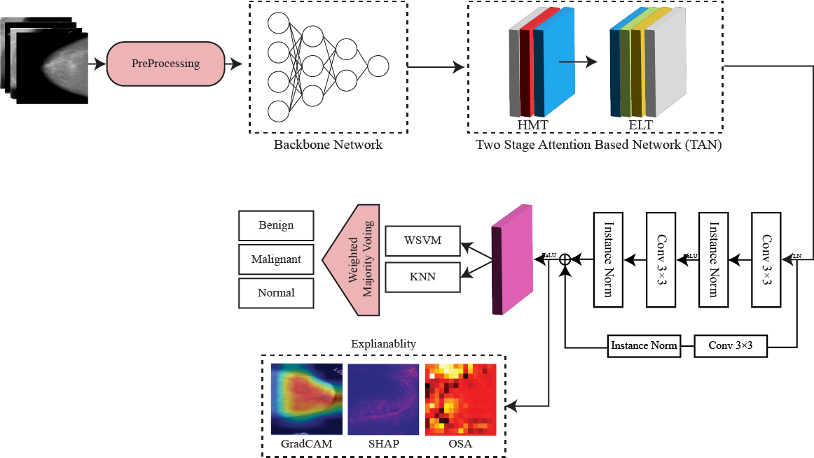

# STARE-Net

A deep learning framework for breast cancer classification using hierarchical multi-scale transformers, edge-aware attention, adaptive contextual refinement, and meta-ensemble classification.

---

# 🧠 Model Architecture



---

# 🚀 Features

- Multi-scale transformer-based mammography analysis
- Edge-aware local attention refinement
- Adaptive contextual feature learning
- Meta-Ensemble Classification (WSVM + KNN)
- Explainable AI (Grad-CAM, SHAP, OSA)
- Lightweight and computationally efficient framework
- Cross-dataset evaluation support
- Reproducible patient-level evaluation pipeline

---

# 📂 Supported Datasets

The framework was evaluated using the following benchmark mammography datasets:

- CBIS-DDSM
- DDSM
- INBreast
- MIAS

> Note:
> The datasets do not originally share identical class structures or annotation formats. A label harmonization strategy was applied to establish a consistent experimental framework across datasets.

---

# 🔒 Patient-Level Dataset Splitting

To prevent data leakage and artificially inflated performance, all datasets are split strictly at the patient/case level prior to preprocessing, augmentation, and training.

This ensures:
- CC/MLO views from the same patient never appear across train/test subsets
- correlated mammographic examinations remain isolated
- leakage-free evaluation protocol

No random image-level splitting was used in the final experimental pipeline.

---

# ⚙️ Preprocessing Pipeline

The preprocessing operations are applied sequentially as follows:

1. Duplicate/corrupted image removal
2. Min-Max intensity normalization
3. Gaussian filtering
4. Image resizing (224×224)
5. Grayscale-to-RGB conversion
6. ImageNet mean/std normalization
7. Online augmentation during training

Training augmentations:
- Horizontal flipping
- Rotation (±15°)
- Brightness/contrast adjustment

Vertical flipping was intentionally excluded to preserve anatomical consistency.

---

# 🧩 Model Components

The complete STARE-Net framework consists of:

- MobileNetV2 Backbone
- HMT (Hierarchical Multi-Scale Transformer)
- ELT (Edge-Aware Local Transformer)
- TAN (Two-Stage Attention Network)
- ACR (Adaptive Contextual Refinement)
- MEC (Meta-Ensemble Classification)

---

# 🗳️ Meta-Ensemble Classification (MEC)

The MEC module operates as a post-training stage.

Feature embeddings extracted from the MLP projection layer are used as input to:
- Weighted SVM (RBF kernel)
- KNN (k=5, Euclidean distance)

Class-specific weights are computed using validation F1-scores.

Final predictions are generated using weighted majority voting.

---

# 🧪 Reproducibility Settings

- Random seed: 42
- Optimizer: AdamW
- Batch size: 32
- Epochs: 100
- Early stopping patience: 10
- Mixed precision training enabled

Hardware:
- NVIDIA Tesla V100 GPU (32GB)

---

# 📦 Installation

```bash
git clone https://github.com/your-repo/STARE-Net.git
cd STARE-Net
pip install -r requirements.txt
```

---

# 📁 Dataset Preparation

Organize datasets as:

```bash
datasets/
│
├── CBIS-DDSM/
├── DDSM/
├── INBreast/
└── MIAS/
```

Patient-level split files should be generated before training.

---

# 🚀 Training

Train STARE-Net:

```bash
python train.py
```

---

# 🧪 Evaluation

Evaluate trained model:

```bash
python test.py
```

---

# 🔄 Cross-Dataset Evaluation

Example:

```bash
python cross_dataset_eval.py
```

This reproduces:
- train-on-one/test-on-another experiments
- domain generalization analysis
- cross-dataset benchmarking

---

# 📊 Reproducing Experimental Results

The repository supports reproduction of:

- Classification tables
- Cross-dataset evaluation
- MEC experiments
- Ablation studies
- Explainability analysis
- ROC and confusion matrices

Each experiment configuration is described in the corresponding script.

---

# 🔍 Explainability

Supported explainability methods:

- Grad-CAM
- SHAP
- Occlusion Sensitivity Analysis (OSA)

> Note:
> XAI analysis is intended for qualitative and internal consistency evaluation and should not be interpreted as clinically validated lesion localization.

---
